# Fase 2: Guia d'Ús Tècnica (Manual Operatiu)

Utilitzant l'eina seleccionada a la Fase 1 (Bitwarden, KeePassX o similar), s'ha creat una guia d'ús per a l'equip tècnic. Aquesta guia és clara i basada en captures de pantalla i instruccions pas a pas.

## 1. Instal·lació i Configuració Inicial

- Descarrega i instal·lació de Bitwarden.
- Creació de la base de dades principal o compte mestre.

Instalem el bitwarden.
 

Obrim el bitwarden.
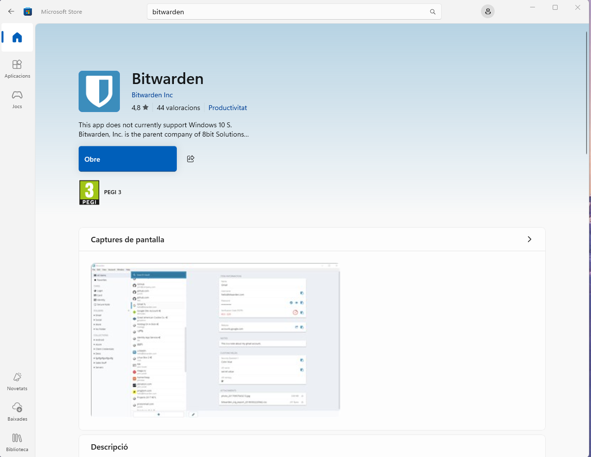 

Creem un compte.
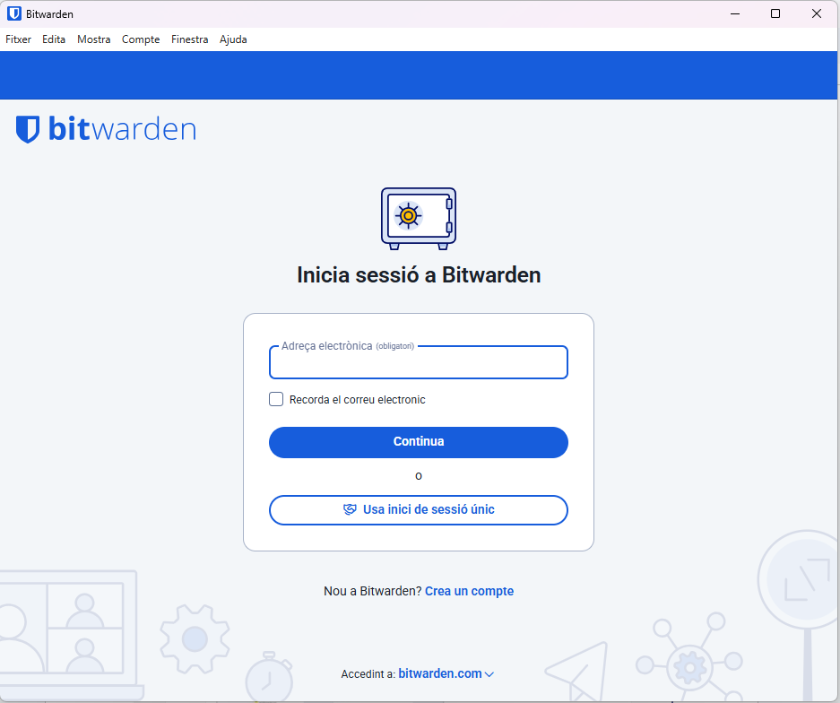 
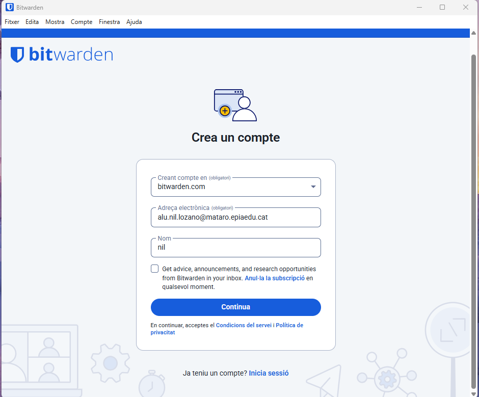 
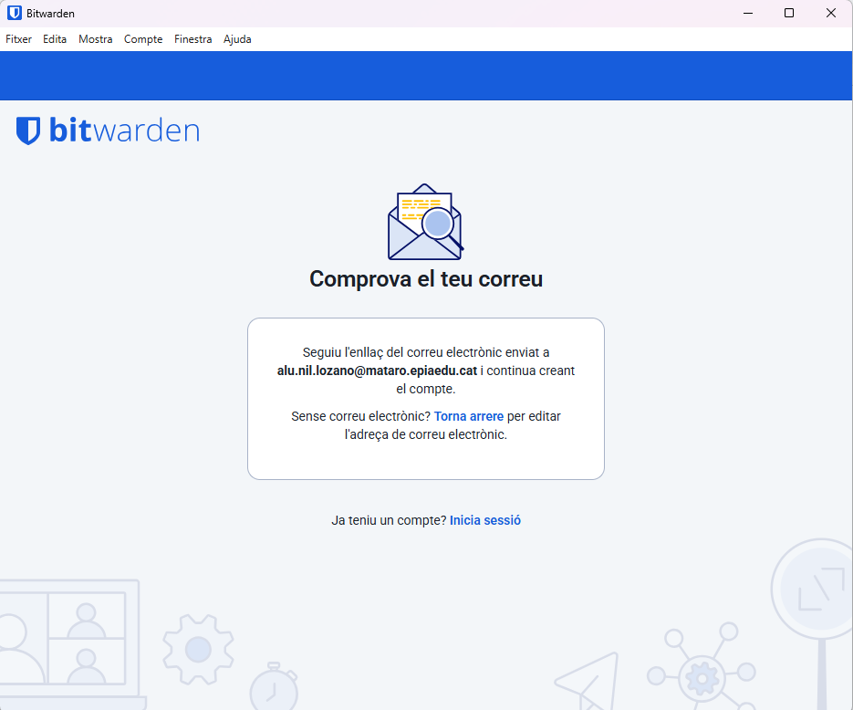
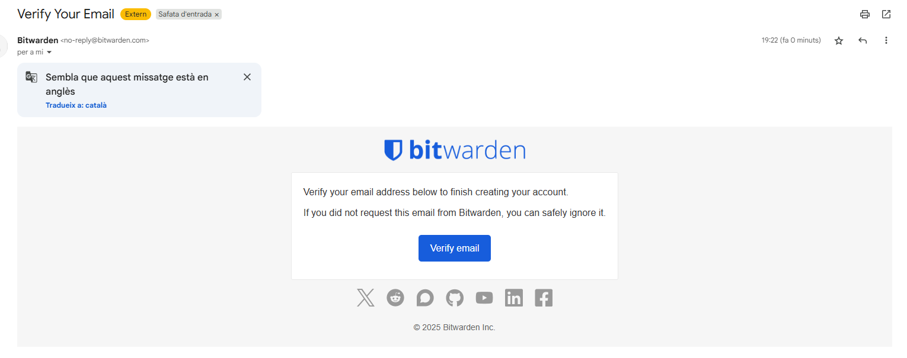
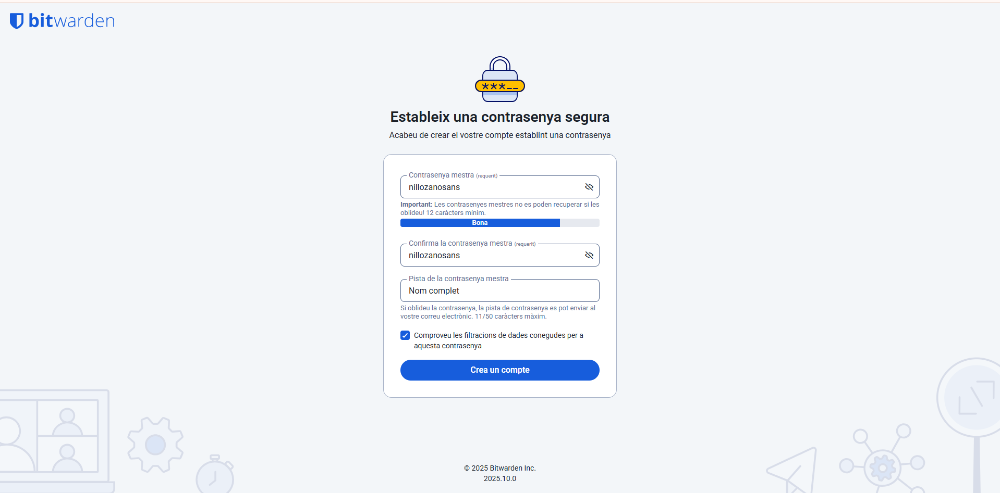

Un cop creada iniciem sessió.
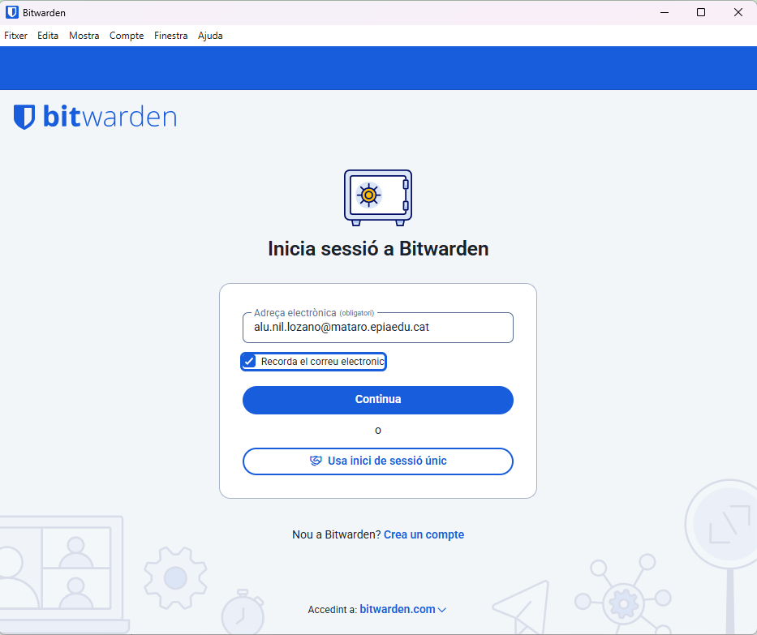

## 2. Generació de Contrasenyes Segures

Explicació de com utilitzar el generador de contrasenyes de l'eina:

- Paràmetres: longitud, caràcters especials, números, majúscules.

Primer de tot obrim el generador de contrasenyes i configurem una contrasenya (el nombre de caràcters, els tipus…)
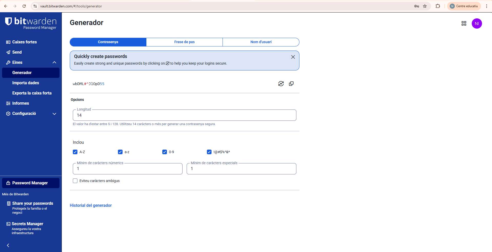 
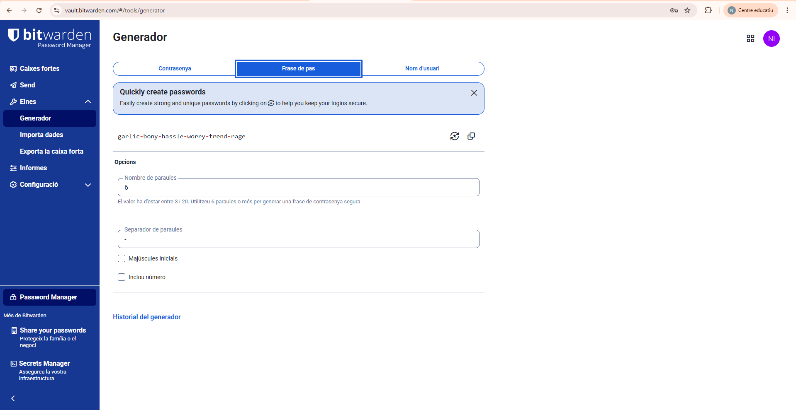
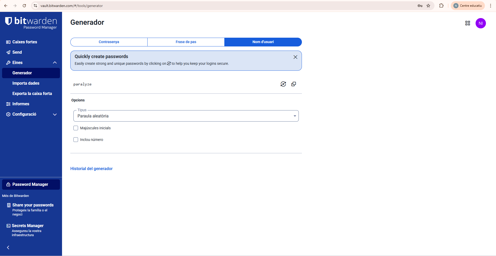
## 3. Exemples d'Ús i Emplenament Automàtic

- Desar una credencial d'un compte de correu electrònic.
- Desar una credencial d'una aplicació o servei web.
- Utilitzar l’extensió del navegador per emplenar automàticament les dades.

Ara dins de caixes fortes a l’apartat nou iniciem la sessió.
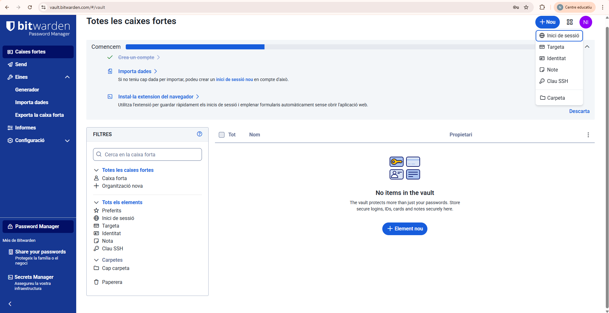 

Seguidament, ens demanaran les credencials.
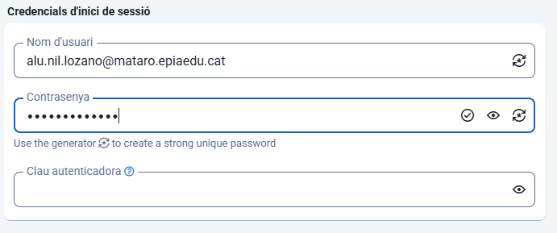 

I per últim posem un URL per guardar una credencial del servei web.
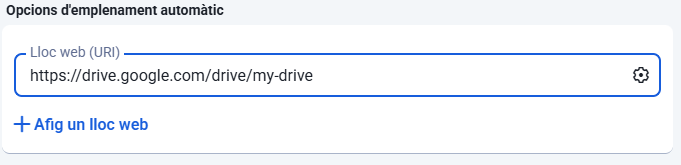
## 4. Gestió de Còpies de Seguretat (Backup)

- Com fer una còpia de seguretat de l'arxiu de contrasenyes (KDBX en KeePass o exportació en Bitwarden).
- Recomanació: emmagatzematge segur (clau USB xifrada o núvol xifrat).

Pel quart punt exportarem la caixa forta, que està dins d’eines.
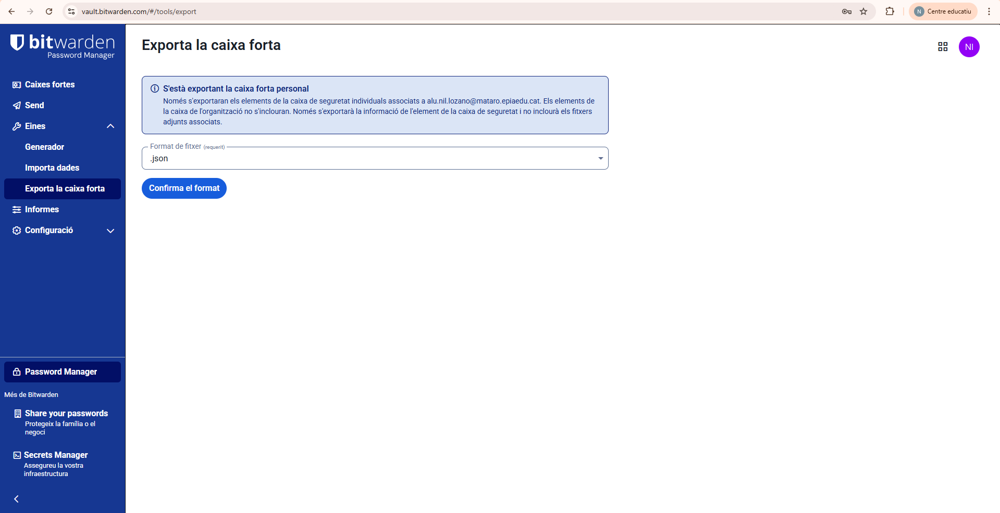 

Per poder exportar ens demanaran les credencials.
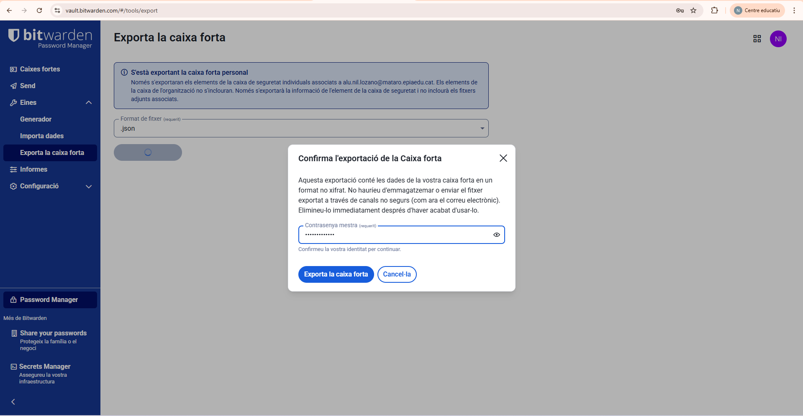 

I ja tindrem la caixa forta baixada.
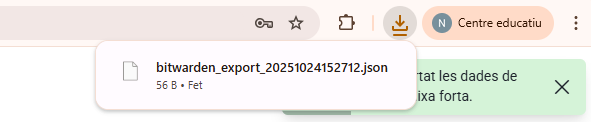

## Torna a l'anucnciat
[Anunciat](Readme.md)
